+++
title = 'Mermaid序列图语法'
date = '2025-09-09T00:26:24+08:00'
author =  "XHao"  # 文章作者
# weight = 1  # 文章权重（数值越大排序越靠前）
# aliases = ["/draft-example"]  # 文章别名（可用于重定向）
tags = ["language"]  # 文章标签（数组形式）
# categories = [""] # 文章分类
description = "Mermaid 序列图语法介绍。"  # 文章描述（用于摘要显示）
draft = false  # 是否为草稿（true表示草稿，不会构建发布）
# mermaid = true # 无需声明，所有文档默认启用 mermaid 支持。
+++

# Mermaid 序列图语法

## 摘要
序列图（Sequence Diagram）是统一建模语言（UML）中一种重要的交互图，它按时间顺序描述了对象之间传递消息的过程，直观地展现了多个参与者为实现某个目标而进行的交互序列。本文档将详细介绍如何使用 Mermaid 语法绘制清晰、规范的序列图。

## 1. 基本结构

一个最基本的 Mermaid 序列图由 `sequenceDiagram` 关键字声明，后跟一系列参与者定义和消息语句。

````markdown
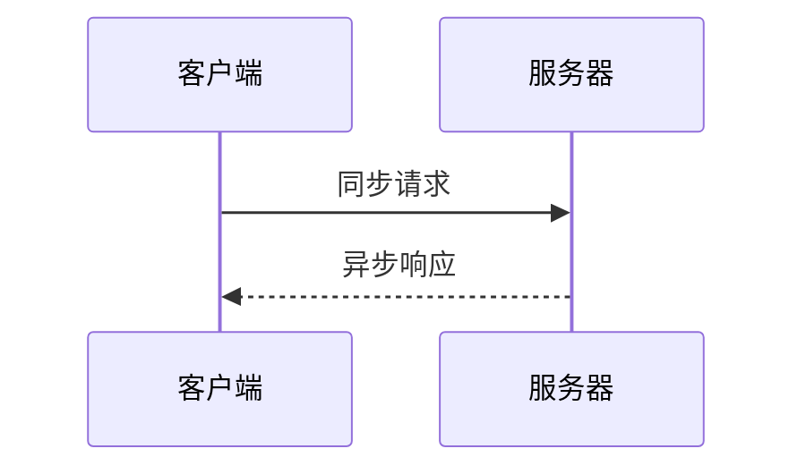
````

此代码将生成如下图表，展示了客户端与服务器之间一次简单的请求-响应交互：


## 2. 参与者（Participants）

参与者代表交互中涉及的对象、组件或系统。

### 2.1 定义参与者
使用 `participant` 关键字定义，并可选择使用 `as` 设置别名。
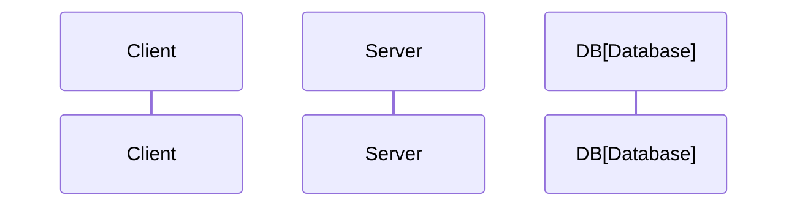
- **`participant S as Server`**: 定义一个参与者 `S`，在图中显示别名为 "Server"。
- **`participant DB[Database]`**: 另一种语法，效果同上，`[ ]` 内为显示名称。

### 2.2 参与者类型
Mermaid 支持多种参与者类型，通过不同关键字生成不同图标（取决于渲染器支持）：
- `actor`: 角色（人形图标）
- `participant`: 普通参与者（默认矩形）
- `database`: 数据库（圆柱形图标）

## 3. 消息（Messages）

消息是参与者之间传递的通信，由带箭头的线表示。

### 3.1 消息类型
| 语法 | 箭头样式 | 描述 | 示例 |
| :--- | :--- | :--- | :--- |
| `->>` | 实线箭头 → | **同步消息**（通常表示函数调用） | `A->>B: Login()` |
| `-->>` | 虚线箭头 --> | **异步消息**（通常表示返回或响应） | `B-->>A: Success` |
| `->` | 实线 —> | 同步消息（无箭头） | `A->B: Message` |
| `-->` | 虚线 --> | 异步消息（无箭头） | `B-->A: Callback` |
| `-x` | 实线末端打叉 —→✕ | **失败/终止消息** | `B-xA: Error` |
| `--x` | 虚线末端打叉 -->✕ | 异步失败消息 | `A--xB: Timeout` |

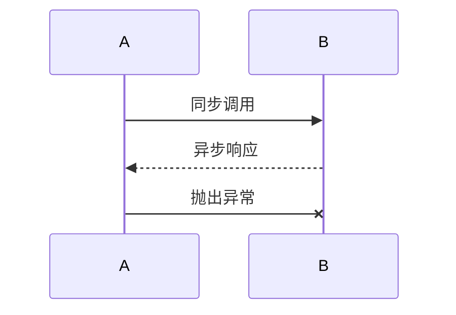

## 4. 激活条（Activation）

激活条（生命线上的矩形框）表示参与者正在执行操作或处理任务的时间段。

- **`activate [参与者]`**: 激活指定参与者的生命线。
- **`deactivate [参与者]`**: 取消激活指定参与者的生命线。

激活条清晰地标识了控制焦点的位置和操作的执行范围。

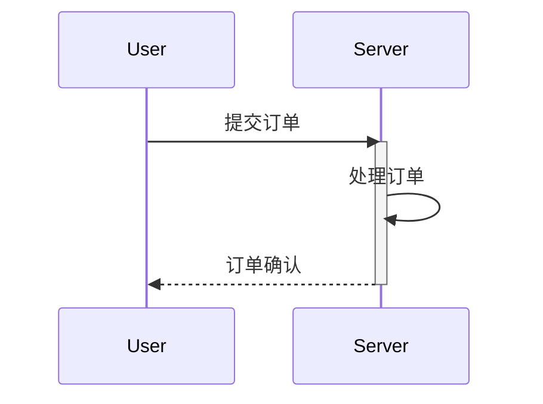

## 5. 注释（Notes）

注释用于为图表添加说明文本，可以放在参与者相对位置或跨越多个参与者。

- `Note right of [参与者]: 注释文本`: 在参与者右侧添加注释。
- `Note left of [参与者]: 注释文本`: 在参与者左侧添加注释。
- `Note over [参与者1],[参与者2]: 注释文本`: 跨越多个参与者添加注释。

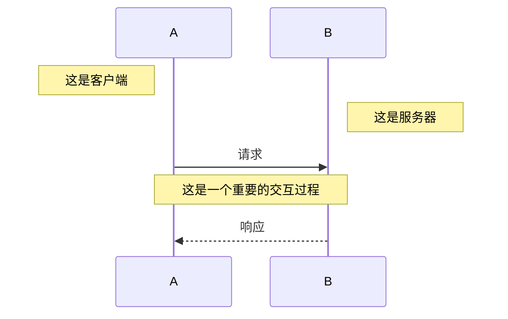

## 6. 逻辑片段（Fragments）

逻辑片段用于表示循环、条件判断等复杂逻辑。

### 6.1 循环片段（Loop）
使用 `loop` 和 `end` 关键字表示一段重复执行的逻辑。
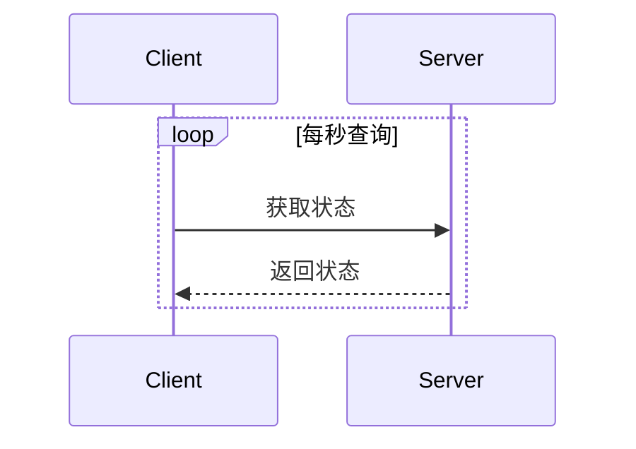

### 6.2 条件片段（Alternative）
使用 `alt`/`else` 和 `end` 关键字表示条件判断。
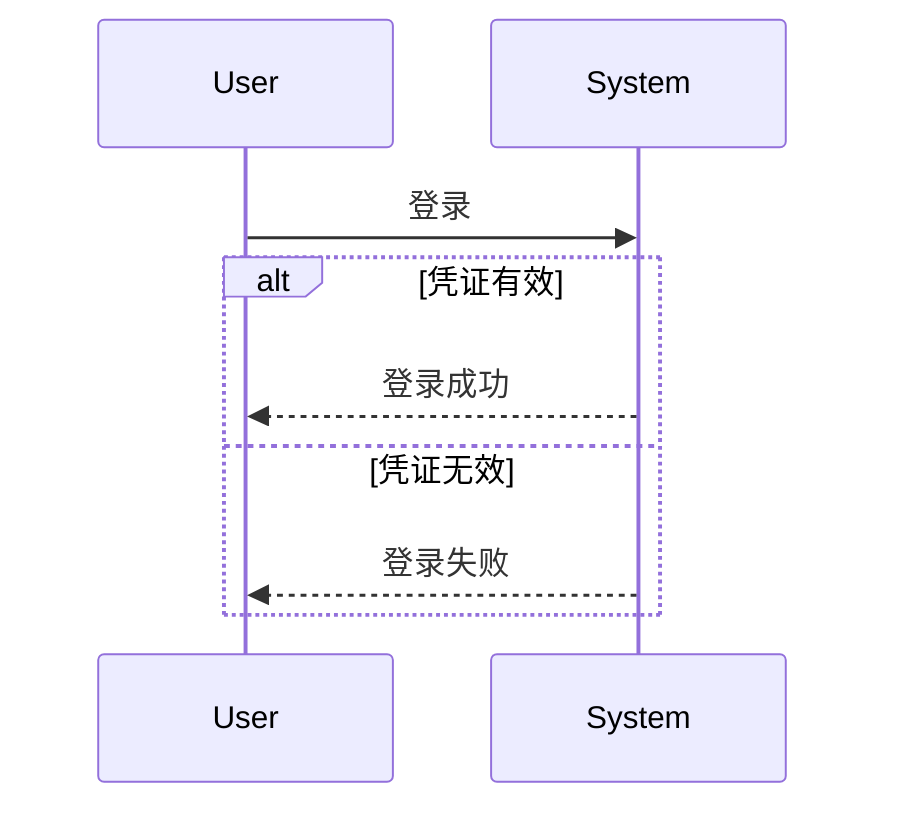

### 6.3 可选片段（Optional）
使用 `opt` 和 `end` 关键字表示可选的执行路径。
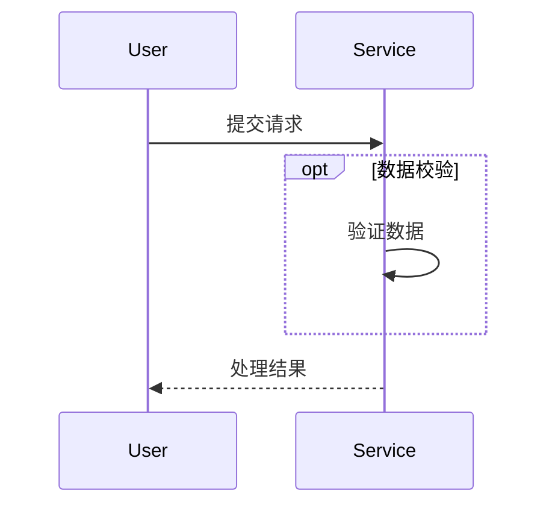

## 7. 其他实用功能

### 7.1 自动编号
使用 `autonumber` 关键字自动为消息添加序列号。
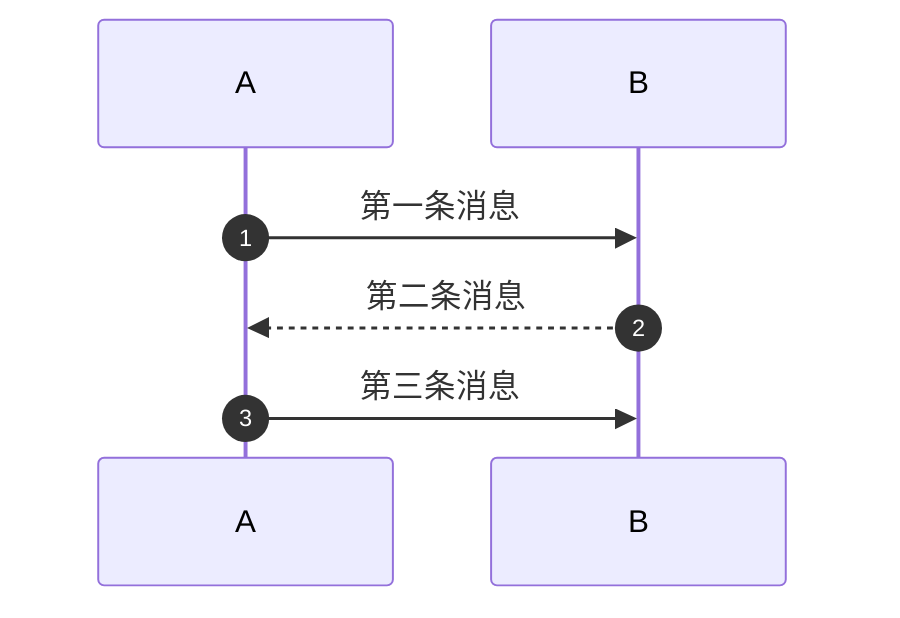

### 7.2 设置标题
使用 `title: 标题文本` 为图表添加标题。
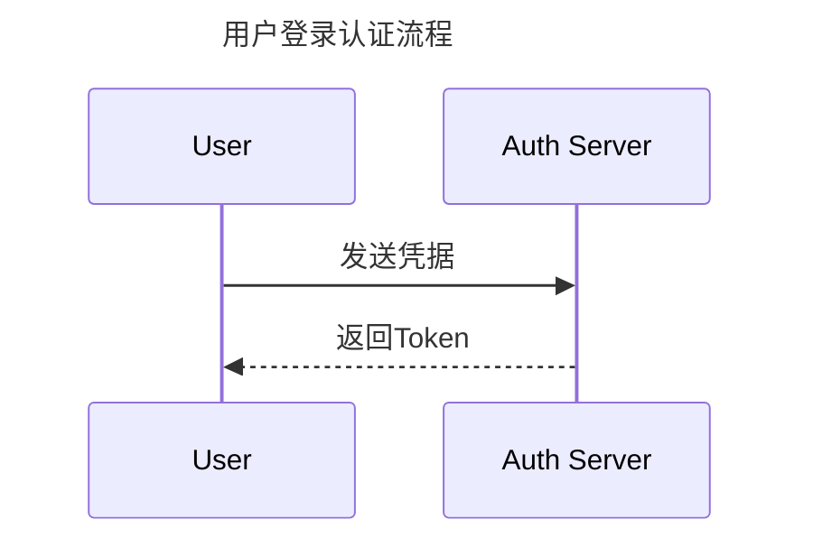

## 8. 完整示例

下面是一个综合多种元素的完整序列图示例：

````markdown
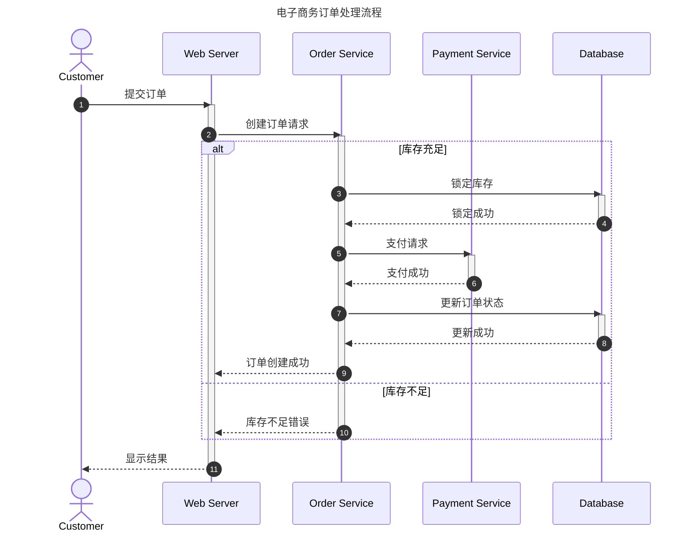
````


## 结论

Mermaid 序列图提供了一种基于文本的强大工具，用于可视化对象之间的交互序列。通过简洁的语法，开发者可以创建出表达清晰、结构规范的序列图，有效支持系统设计、架构分析和文档编写工作。其与 Markdown 的良好集成特性，使其成为技术文档编写的理想选择。
