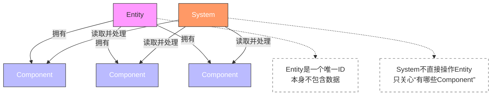
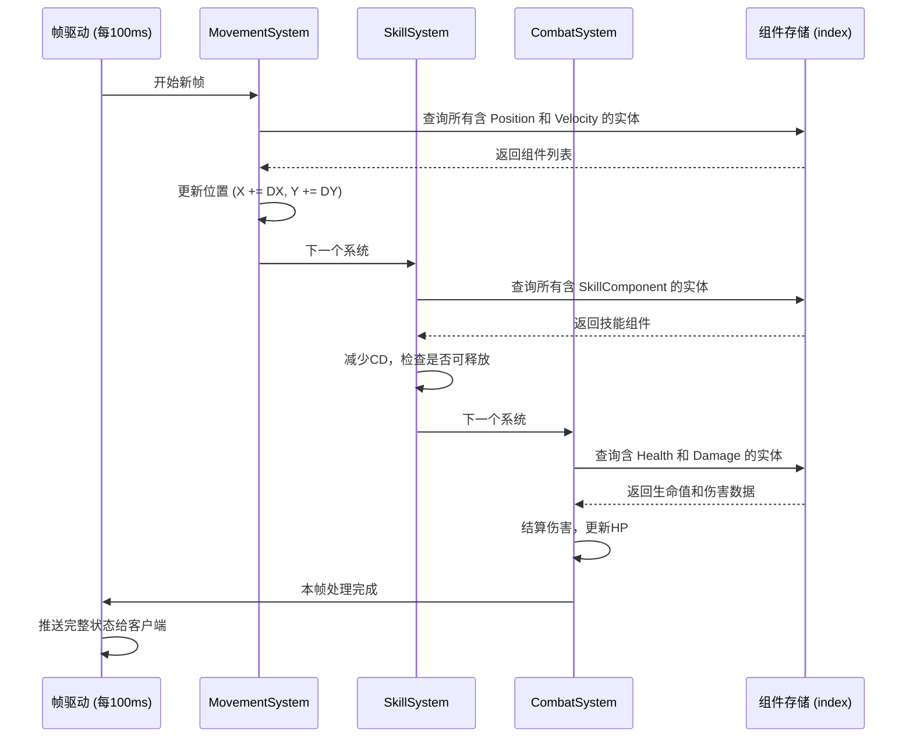
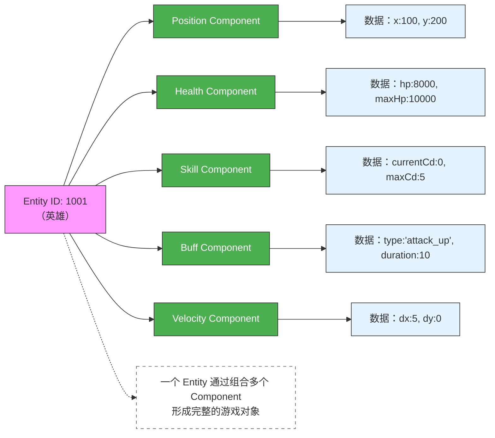
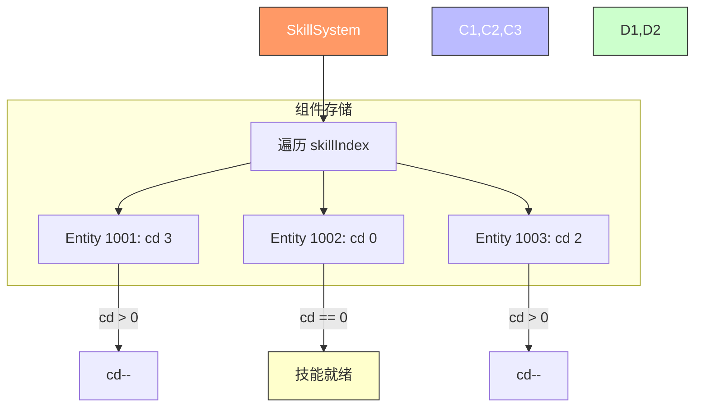

+++
date = '2025-09-25T23:40:30+08:00'
draft = false
title = 'ECS介绍'
mermaid = true
+++

# ECS 架构详细介绍

ECS 是一种在游戏开发中广泛使用的程序架构模式，特别适合需要处理大量动态对象的实时系统，如战斗系统、物理模拟、策略游戏等。它的名字来源于三个核心概念：Entity（实体）、Component（组件）和 System（系统）。对于刚接触这一概念的人来说，ECS 可能与传统的面向对象编程（OOP）有很大不同，但它在性能、可维护性和扩展性方面具有显著优势。

本文将从基础概念、组成部分、应用场景、如何应用以及思维方式等方面，为新手详细讲解 ECS。

---

## 一、ECS 的核心组成部分

ECS 的设计思想是“数据与逻辑分离”，它把游戏中的每一个对象拆解为三个部分：

### 1. Entity（实体）

- **是什么**：Entity 是一个“空壳”，它本身不包含任何数据或行为，只是一个唯一的标识符（通常是整数 ID）。
- **作用**：用来“关联”多个组件，表示一个游戏中的“东西”，比如一个英雄、一个敌人、一个技能特效。
- **举例**：  
  你有一个英雄角色，它的 Entity ID 可能是 `1001`。这个 ID 本身不代表任何东西，但它可以“拥有”多个组件，比如位置、生命值、技能等。

> 简单理解：Entity 就像一个“身份证号”，它不描述这个人长什么样，但通过这个号码可以查到他的所有信息。

### 2. Component（组件）

- **是什么**：Component 是纯粹的数据容器，用于描述 Entity 的某一种状态或属性。
- **特点**：
  - 只包含数据，不包含任何逻辑或方法。
  - 每个 Component 聚焦于一个单一功能。
  - 多个 Component 可以组合在一起，构成一个完整的对象。
- **举例**：
  - `PositionComponent`：包含 `x` 和 `y` 坐标。
  - `HealthComponent`：包含当前生命值 `hp` 和最大生命值 `maxHp`。
  - `SkillComponent`：包含技能 ID、当前冷却时间 `currentCd`、最大冷却时间 `maxCd`。
  - `BuffComponent`：包含 Buff 类型、持续时间、效果值。

> 简单理解：Component 就像“标签”或“属性卡片”，一个 Entity 可以贴多个标签，比如“有位置”、“有血量”、“有技能”。

### 3. System（系统）

- **是什么**：System 是处理逻辑的模块，它负责遍历所有具有特定组件的 Entity，并对这些组件进行操作。
- **特点**：
  - 包含业务逻辑，但不直接操作 Entity。
  - 只关心“有哪些组件”，不关心“是谁”。
  - 通常是按帧批量执行的。
- **举例**：
  - `MovementSystem`：查找所有拥有 `PositionComponent` 和 `VelocityComponent` 的 Entity，更新它们的位置。
  - `SkillSystem`：查找所有拥有 `SkillComponent` 的 Entity，每帧减少其冷却时间，如果 CD 结束则触发技能。
  - `CombatSystem`：查找所有拥有 `HealthComponent` 的 Entity，处理伤害结算。
  - `BuffSystem`：查找所有拥有 `BuffComponent` 的 Entity，每帧减少持续时间，过期则移除。

> 简单理解：System 就像“工人”，他们每天去“工地”（组件集合）干活，只关心“哪里有活要干”，不关心“这个活是谁的”。

---

## 二、ECS 的典型应用场景

ECS 特别适合以下类型的系统：

- **战斗系统**：需要处理多个单位的位置、技能、Buff、伤害等，状态变化频繁。
- **物理引擎**：需要高效计算大量对象的碰撞、移动、速度等。
- **策略游戏（SLG）**：单位数量多，逻辑复杂，需要高性能和确定性。
- **多人在线游戏**：需要同步状态，ECS 的数据驱动特性便于序列化和网络传输。
- **自动化系统**：如自动寻路、AI 决策、资源管理等。

---

## 三、如何应用 ECS：一个简单例子

假设我们要实现一个英雄的自动移动和技能释放。

### 步骤 1：定义 Components

```go
type Position struct {
    X, Y float64
}

type Velocity struct {
    DX, DY float64
}

type Health struct {
    HP, MaxHP int
}

type Skill struct {
    CurrentCD int
    MaxCD     int
}
```

### 步骤 2：创建 Entity

```go
heroID := 1001
```

### 步骤 3：为 Entity 添加 Components

```go
positionIndex[1001] = &Position{X: 100, Y: 200}
velocityIndex[1001] = &Velocity{DX: 10, DY: 5}
healthIndex[1001] = &Health{HP: 1000, MaxHP: 1000}
skillIndex[1001] = &Skill{CurrentCD: 0, MaxCD: 5}
```

### 步骤 4：编写 Systems

```go
// MovementSystem：更新位置
func UpdateMovement() {
    for id, pos := range positionIndex {
        vel := velocityIndex[id]
        if vel != nil {
            pos.X += vel.DX
            pos.Y += vel.DY
        }
    }
}

// SkillSystem：更新技能 CD
func UpdateSkills() {
    for _, skill := range skillIndex {
        if skill.CurrentCD > 0 {
            skill.CurrentCD--
        }
    }
}
```

### 步骤 5：主循环调用

```go
for {
    UpdateMovement()
    UpdateSkills()
    // 其他系统...
    time.Sleep(100 * time.Millisecond) // 每 100ms 一帧
}
```

---

## 四、如何思考和划分 ECS 结构

### 1. 从“行为”出发，而不是“对象”出发

传统 OOP 思考方式：  
“我有一个英雄类，它会移动、会放技能、有血量。”

ECS 思考方式：  
“哪些东西需要移动？→ 有 `Position` 和 `Velocity` 的对象。”  
“哪些东西有技能？→ 有 `Skill` 组件的对象。”  
“哪些东西会受伤？→ 有 `Health` 组件的对象。”

### 2. 如何划分 Component？

- **单一职责**：每个 Component 只负责一个功能。
- **可复用**：`Position` 组件可以被英雄、敌人、子弹共用。
- **避免大对象**：不要把所有属性塞进一个 `HeroData` 结构体。

### 3. 如何划分 System？

- **按功能划分**：每个 System 负责一类逻辑。
- **批量处理**：System 应能高效遍历所有相关组件。
- **顺序执行**：注意 System 的执行顺序，比如先更新位置，再处理碰撞。

### 4. 数据存储方式

- 通常使用全局的“索引”（index）来存储组件，例如：
  - `positionIndex[entityID] = &Position{...}`
  - `healthIndex[entityID] = &Health{...}`
- 这样 System 可以直接遍历某个 index，而不需要遍历所有 Entity。

---

## 五、ECS 的优势与挑战

### 优势

- **性能高**：数据连续存储，缓存友好，适合批量处理。
- **扩展性强**：新增功能只需添加新的 Component 和 System，不影响现有代码。
- **可维护性好**：逻辑集中，数据清晰，易于调试和测试。
- **支持确定性模拟**：适合做战斗回放、网络同步。

### 挑战

- **学习成本高**：与传统 OOP 思维不同，需要转变观念。
- **调试复杂**：Entity 只是 ID，查看完整状态需要组合多个 Component。
- **过度设计风险**：小型项目可能不需要 ECS。

---

## 六、图表展示

### 1. ECS 核心结构图（三要素关系）



---

### 2. ECS 数据流动与处理流程（帧循环）



---

### 3. 一个具体 Entity 的组件组合示例



---

### 4. System 如何批量处理 Component



---

## 七、总结

ECS 是一种将数据（Component）与逻辑（System）分离的架构模式，通过 Entity 作为标识符将它们关联起来。它鼓励你从“功能”和“行为”的角度去思考系统设计，而不是从“对象继承”的角度。

在实际应用中，ECS 能帮助你构建高性能、易扩展、易维护的游戏系统。虽然初期学习曲线较陡，但一旦掌握，你会发现它在处理复杂实时系统时的强大优势。

对于新手，建议从小项目开始尝试，比如实现一个简单的移动和碰撞系统，逐步理解 ECS 的思维方式。