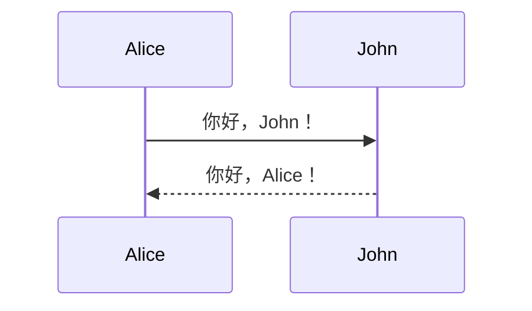
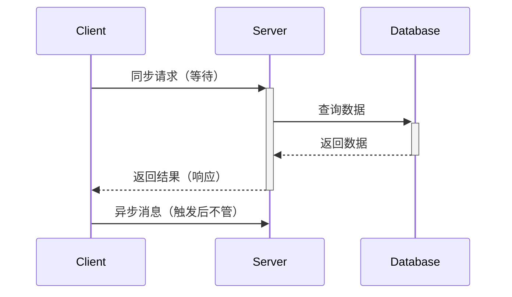
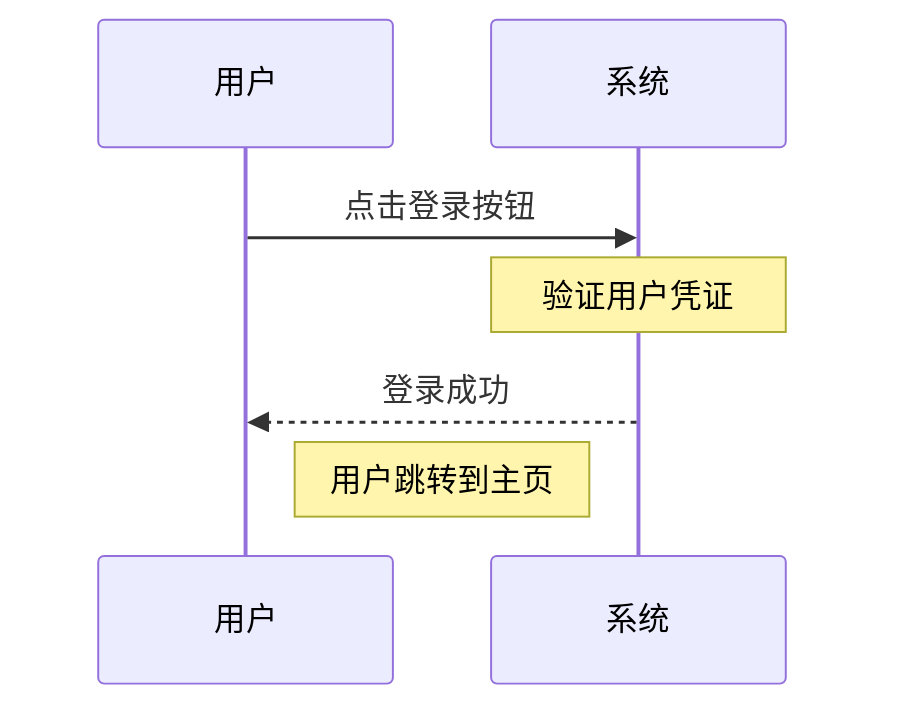
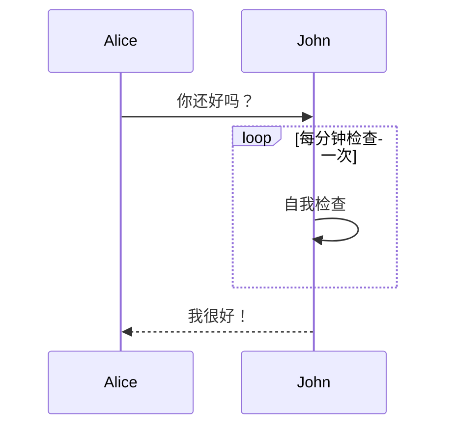
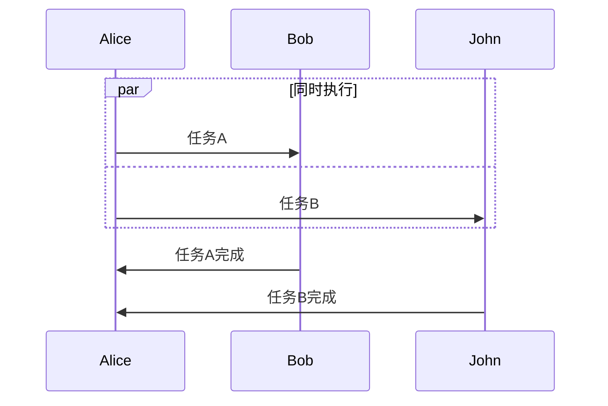
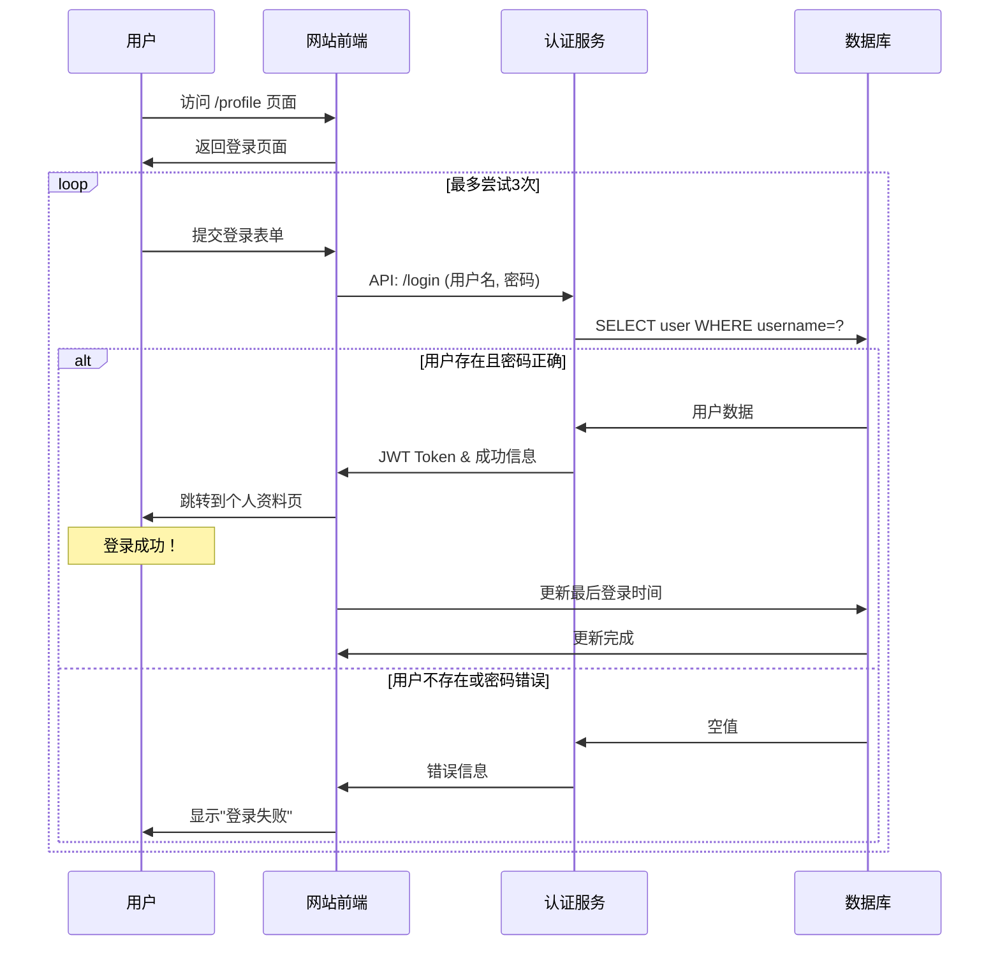

+++
date = '2025-09-14T23:37:34+08:00'
draft = false
title = 'Mermaid示例'
mermaid = true
tags = ['示例']
+++

# Mermaid 图表示例

## 序列图

序列图用于展示对象之间交互的时序关系。

序列图是一种 UML 行为图，它按时间顺序描述了对象之间传递消息的过程。非常使用于建模场景流程、API 交互和理解系统的动态行为。

### 基本语法结构

一个基本的 Mermaid 序列图由以下部分组成：
1. 参与者：交互的对象。
2. 消息：参与者之间传递的通信。
3. 激活期：参与者执行操作的时间段。
4. 注释：对图的说明。
5. 循环、条件等：控制逻辑。

步骤
1. 声明图表类型为序列图 `sequenceDiagram` 。
2. 定义参与者：可以按出现的顺序隐式定义，也可以预先显式定义。
3. 消息（箭头）：消息是序列图的核心，用不同类型的箭头表示不同类型的交互。
4. 激活期：是参与者框体上的长方形，表示该参与者正在执行操作。通常由同步消息（`->>+`）创建，由返回消息（`-->>-`）结束。
   - `->>+` ：激活目标参与者。
   - `-->>-` ：取消激活源参与者。
5. 注释和控制逻辑
   - 注释：使用 `Note` 关键字添加注释。
   - 控制逻辑：循环、条件判断和并行。

#### 参与者

- 隐式定义：直接在消息中引用，Mermaid 会按出现顺序自动创建。



- 显示定义：使用 `participant` 关键字预先定义。这样可以控制出现顺序和设置别名。


语法

``` txt
sequenceDiagram
    participant A as Alice
    participant J as John
    A->>J: 你好，John！
    J-->>A: 你好，Alice！
```

#### 消息（箭头）

| 类型 | 语法 | 描述 | 
| :--- | :--- | :--- | 
| **同步消息** | `->>` 或 `-》` | 实线箭头，表示等待响应的调用（如函数调用）。 | 
| **异步消息** | `->>` 或 `-》》` | 开放式箭头，表示不等待响应的消息（如触发事件）。 | 
| **返回消息** | `-->>` 或 `--》` | 虚线箭头，通常用于表示返回值，可省略。 | 
| **自调用消息** | `->>+` 或 `-》+` | 指向自身的箭头，表示对象自身的方法调用。 | 



*语法：*

``` txt
sequenceDiagram
    Client->>+Server: 同步请求（等待）
    Server->>+Database: 查询数据
    Database-->>-Server: 返回数据
    Server-->>-Client: 返回结果（响应）
    Client->>Server: 异步消息（触发后不管）
```
*注意：`+` 和 `-` 用于激活期的控制。*

#### 激活期

激活期（Activation）是参与者框体上的长方形，表示该参与者正在执行操作。通常由同步消息（`->>+`）创建，由返回消息（`-->>-`）结束。

- `->>+`：激活目标参与者。
- `-->>-`：取消激活源参与者。

#### 注释和控制逻辑

##### 注释
使用 `Note` 关键字添加注释。
-   `Note right of A: 在A右侧的注释`
-   `Note left of B: 在B左侧的注释`
-   `Note over A, B: 跨越A和B的注释`


*语法：*

```
sequenceDiagram
    participant U as 用户
    participant S as 系统
    U->>S: 点击登录按钮
    Note over S: 验证用户凭证
    S-->>U: 登录成功
    Note right of U: 用户跳转到主页
```

##### 循环 - Loop
表示一段代码或交互会重复执行。

```
loop 循环说明
    ... 循环体内的消息 ...
end
```


*语法：*

```
sequenceDiagram
    Alice->>John: 你还好吗？
    loop 每分钟检查一次
        John->>John: 自我检查
    end
    John-->>Alice: 我很好！
```

##### 条件判断 - Alt / Opt
表示 if...else 逻辑。

*   `alt`：表示 if/else 条件。
*   `opt`：表示可选情况（相当于 if，没有 else）。

```
alt 条件说明
    ... 条件1为真时的消息 ...
else
    ... 其他条件为真时的消息 ...
end

opt 可选情况说明
    ... 情况发生时的消息 ...
end
```

```mermaid
sequenceDiagram
    User->>+System: 输入用户名和密码
    alt 凭证正确
        System-->>-User: 显示主页
    else 凭证错误
        System-->>-User: 显示错误信息
    end
    opt 记住我
        User->>System: 保存登录状态
    end
```
*语法：*
```
sequenceDiagram
    User->>+System: 输入用户名和密码
    alt 凭证正确
        System-->>-User: 显示主页
    else 凭证错误
        System-->>-User: 显示错误信息
    end
    opt 记住我
        User->>System: 保存登录状态
    end
```

##### 并行 - Par
表示同时发生的交互。

```
par 并行说明
    ... 线程1 ...
and
    ... 线程2 ...
and
    ... 线程3 ...
end
```


*语法：*

```
sequenceDiagram
    par 同时执行
        Alice->>Bob: 任务A
    and
        Alice->>John: 任务B
    end
    Bob->>Alice: 任务A完成
    John->>Alice: 任务B完成
```


### 完整示例

下面是一个结合了多种语法的完整示例：


